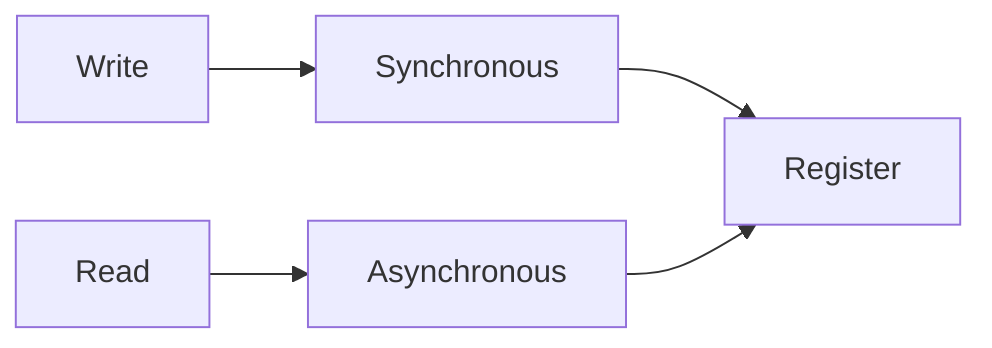

# Lab 3

## Register files
- Two address inputs -> two data Out
- One write address

#### I/O

- The content at an address represents a **MIPS** register

## Lab info

- for MPG it's not ok to have 2 instances
- for the second assignment upload also modified mpg & register file

## Quiz Next Week
- Pen and paper quiz next week
- Schematic with components (first 3 labs) -> implement that schematic in vhdl (pen and paper).
- allowed to look at the language templates 

