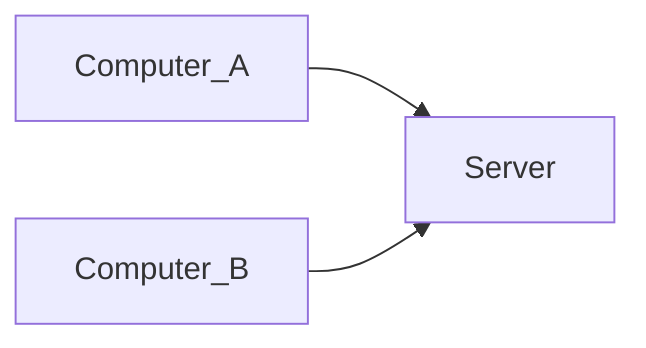

# Course Notes 05.04.2022 :stars:

## Today 
- sisteme de versionare, Git
- administrare proiecte Vivado, Vitis

## Sisteme de versionare :recycle:
-> control asupra dezvoltarii, echipe mari
-> keep track of progress (past modification) (*for bugfixing for example*)
-> ownership of the code

(useful for any piece of data)

## History
- SCCS at Bell Labs (only local) (evidenta muncii individuale)
- $2^{nd}$ generation (CVS) 
- $3^{rd}$ generation (distributed with all clients being equal) - *Bitkeeper*

How was Git born?
- Linux updates were made by email (long thread of e-mails). -> proposal Bitkeeper -> Git

### Differences between versioning systems
- *distributed*
- *merge* concurrency model
- changeset = stocam doar modificari dintre versiuni 
- *snapshot* = stocare o copie integrala la fiecare noua versiune

- *GPL* license = open source; (free)

## Terminology

- server is like a back-up

Repository = baza de date (istoric dezvoltare + fisiere themselves) (toate informatiile care o fost vreodata in database)
- like DAG where the nodes are files in a certain version
- root = initial commit

how? 
- director .git (hidden) care contine intr-un format intern toate datele

### Checkout
- scoate (makes available) fisierele dintr-o anumita versiune
- fisierele ajung in directorul de lucru
- HEAD pointer poanteaza la commit-ul care se afla in working directory (indirect, Header poanteaza la branch-ul master)

### Stage fixes
- puse in staging area (draft ish)

### Commit
- add to database in repo
- are: un hash (commit id string)
  - un pointer catre commit ul parinte
  - autor
  - creator (committer)

### Branch
- fir de dezvoltare a "aplicatiei"

Merge branches:
- îmbinare fire de dezvoltare
- imbinare intr-un commit nou
- more suitable when multiple branches appear

Rebase -> modificarile sunt inlantuite

**Discussion**: compare + & - for rebase and merge

### Remote
- numele lui este origin 
- se refera la server

### Fetch
- brings from remote the database copy and intefrates with our local copy
- s-ar putea sa avem mai multe branch-uri (origin/master + master)
- master nu o sa fie suprascris (Git never overwrites data by default)

### Conflict
- changes in the same section of the code
- rezolvate de persoana care face merge/rebase (the programmer compares all the sets of changes and decides what overwrites what)

## Github
- reference for source codes
- for Zybo we can go to a branch to see some sort of a demo

## Clone
- git connects to the given adress and brings a copy of the database stored there
- makes a checkout on the master branch (default)

`gitk -- all` - shows the DAG

pt Digilent Github - un demo se dezvolta pe branch-ul propriu

`git tag --list` - shows all the tags in repo

### Tags

`git submodule`

## Reverse changes in git
- we want to go to the previous state
`git reset` - moves current branch on the parent of the current HEAD
`git revert` - we keep the ***răzgândeală*** and make a new commit identical to the previous one (folosit cand suntem deja pe remote)

## Remote
- head is detached error (detached head state)

Git garbage collector - similar to java garbage collector

## TODO:
1. learnGitBranching.js.org
move2, the rest of exercises from (pick the one you liked or didn't understand)

- make sure to understand
  ### Questions:
  - rebase make sure to understand what rebase into what
  - my pick Remote advaced 1

- next week Vivado & Vitis versioning + simulate collaboration on GitHub + Solve conflicts
