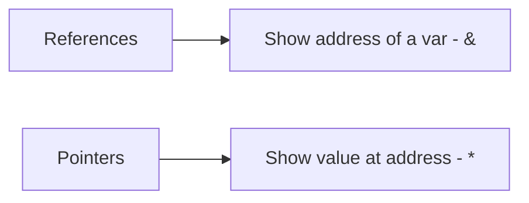

# CPP

About the language:
- cross-platform, OOP
- OS, GUI, embedded

## Namespaces
- Like a Java package
- express that we use a certain namespace with the specifier 
```
namespace_name::function(); //only import used function
```

## Data types
### Arrays:
- type -> name -> size 
- if we don't specify the size we must initialize some values 
```
my_array[] = {val1, val2, val3};
```

## References & Pointers



## OOP Features

```
friend std::ostream& operator<< (std::ostream &out, const mat3& srcMatrix);
//gives additional rights to the insertion function (is a "friend" of the class)
```

- Atribute default private

```
public:
  int a;
private:
  int c;
```

- Deconstructor - free objects

- Ne ocupăm noi de dealocări
