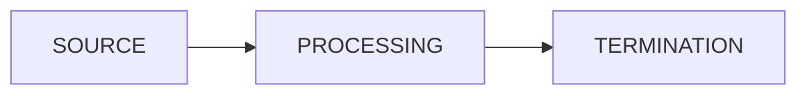

# Course 02.05.2022 Functional :banana:

# Intro
- the same result is returned for the same input
- +easy to test
- +easy to debug
- program is done through composing functions

Advantages:
- pass behavior as parameters
- less code to write
- faster development
- less code complexity

|Functions :|
|-|
|Filter|
|Map|
|Max|

# Lambda expressions
- functions are treated as values
- describe behaviors
> Anonymouys functions (methods with no class)

```java
(parameters) -> {lambda body}
```
## Functional Interfaces
- contain an abstract method that is implemented through the lambda expression

@FunctionalInterface annotation

Defined interfaces:
```java
@FunctionalInterface
public interface Supplier<T> { T get(); }

@FunctionalInterface
public interface Consumer<T> { void accept(T t);}

@FunctionalInterface
public interface Predicate<T> { boolean test(T t);}

@FunctionalInterface
public interface Function<T, R> { R apply(T t);}
```

- method reference (reuse method as lambda expression)
```java
target_reference :: method_name

//e.g.

(String s) -> Intefer.parseInt(s);
//equivqalent to:
Integer::parseInt
```

## Remarks
- variables used in lambda expressions need to be:
  - in the surrounding scope
  - effectively final (not necessarely stated final)

- what does "this" mean :grin:
  - enclosing object

## Examples in Collections:

```java
myList.sort((x, y) -> x.length() - y.length()); //can use lambda in sort / forEach, removeIf, ...
```
---

# Streams
> An aggregate of computations (up to infinite)

- ca o banda de productie

- more operations that could work in parallel



- pipeline is evaluated only at terminal operations

## Output:
- objects 
- for primitives we can use IntStream, DoubleStream, LongStream


## Operations:
- Map : transforms a dataset into another
- flatMap : transforms a stream of streams to one stream
- terminal operations - determine evaluation of the result

### Map
- intermediate operation
- outputs a stream 
- 1-to-1 stream 

### FlatMap
- 1-to-many mapping 

### Boxed
- wraps as objects

### Collect
- collect(toList())

### Reduce
- de ex. face suma

## Debugging

## Optional class
- solves the situation when a function doesn't return a value

# Until next wednesday:
- questions about software industry?
- anything else

# TODO:
- nota pe baza proiectului -> 2 sap
- quiz-urile -> 2 sapt dupa cursul in sine
