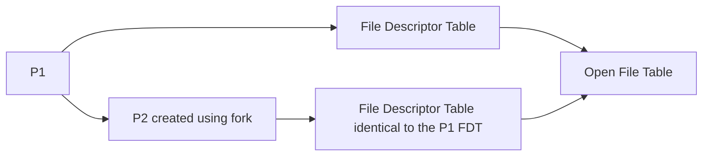

# Lab 11.0 Synthesis reading material Pipes

## Linux Pipes
`annotations`

> Files used for communication between processes of the same system.

### Pipe operations
`special kind of file -> high level`

similar to normal files (operations using `bytes`):
- Open
- Read
- Write

differences?
- FIFO organization (Queue) - cannot use lseek sysCall.
- synchronization mechanisms included: 
  - read from empty file / write in full file => calling thread is blocked (until resources become available)
  - the end of the pipe file is never reached
 
  More synchronization remarks:
  1. No writer processes to the file, a process A tries to read from an empty pipe => A is blocked && read() returns 0.

  2. No reader processes to the file, a process B tries to write to pipe => B is terminated && exception SIGPIPE

```
avoid the issures with SIGPIPE => open for writing using the second parameters O_NDELAY or O_NONBLOCK.
```

Bad situation: a process opens a pipe for RDWR, wants to read from the empty pipe, and is blocked waiting for a writer. He is seen as a possible writer but it will never actually write.

## 1. Named Pipes
```c
#include <sys/types.h>
#include <sys/stat.h>
#include <fcntl.h>
#include <unistd.h>

/*
* Create new named pipe file
* @return 0 for success -1 in case of failure
* @param path name = destination of new file (if not specified it will be placed in the current dir)
* @param acc_rights and type: 0777 | S_ISFIFO
* @param disp = 0
*/
int mknod(const char *path_name, mode_t acc_rights_and_type, dev_t disp);

/**
* Same ish - `more often used`
*/
int mkfifo(const char *path_name, mode_t acc_rights);
```

Delete: use unlink function

Example:
```c
#include <sys/types.h>
#include <sys/stat.h>
#include <fcntl.h>
#include <unistd.h>
#include <string.h>

// program1.c C code of the first process

int main(int argc, char **argv) {

  if (argc != 2) {
    printf ("Use: %s message", argv[0]);
    exit(0);
  }
  mkfifo("/tmp/FIFO", 0600);
  fd = open("/tmp/FIFO", O_WRONLY);
  write(fd, argv[1], strlen(argv[1]));
}

// program2.c - C code of the second process

int main(int argc, char **argv) {
  char buf[10];
  fd = open("/tmp/FIFO", O_RDONLY);
  if (fd < 0) {
    perror("Error opening pipe");
    exit(1);
  }
  
  n = read(fd, buf, 6);
  buf[n] = 0;
  printf("Read from pipe: %s\n", buf);
}
```
`tables pag 918 "The Linux Programming Interface" describe the behavior of FIFOs`


## 2. Unnamed Pipes
> Created using syscall pipe

`somehow useless in the Inter-Process Communication`
```c
#include <unistd.h>

/**
* @return 0 success -1 error
* @param fd[2] memory for two descriptors fd[0] descriptor for reading fd[1] desc for writing
*/
int pipe(int fd[2]);
```

Who can access pipe?
- Calling process
- Its children (created with `fork()`) that inherit the FDT (file descriptor table). FDT contains references to the slots in OFT (open file table)

Why to use?
- is like a private channel between family members

```c
#include <stdio.h>
#include <sys/types.h>
#include <unistd.h>

int fd[2];
int pid, n;
int buf[100];

pipe(fd);
pid = fork(); 

if (pid == 0) {  // child process
  read(fd[0], buf, 7);
  buf[n] = 0;
  printf("The child received: %s\n", buf);
  n = write(fd[1], "FIU", 3);
  printf("The child has transmitted: FIU\n");
}

else {// parent process
  write(fd[1], "PARENT", 7);
  printf("Parent has sent: PARENT\n");
  read(fd[0], buf, 3);
  buf[n] = 0;
  printf("Parent has received: %s\n", buf);
}
//bidirectional communication
```



## 4. Bidirectional and Unidirectional Popes

- bidirectional communication may cause processes to read and write the same information (unwanted) ==> create unidirectional pipes to make sure it s fine

```c
#include <stdio.h>
#include <sys/types.h>
#include <unistd.h>

int fdToLeft[2], fdToRight[2];
int pid, n;
int buf[100];


pipe(fdToRight); // parent to child pipe
pipe(fdToLeft); // child to parent pipe

pid = fork();

if (pid == 0) { // child process
  close(fdToLeft[0]);
  close(fdToRight [1]);
  read(fdToRight[0], buf, 7);
  buf[n] = 0;
  printf("Child has received: %s\n", buf);
  n = write(fdToLeft[1], "CHILD", 3);
  printf("Child has sent: CHILD\n");
}

else { // parent process
  close(fdToLeft[1]);
  close(fdToRight[0]);
  write(fdToRight[1], "PARENT", 7);
  printf("Parent has sent: PARENT\n");
  read(fdToLeft[0], buf, 3);
  buf[n] = 0;
  printf("Parent has received: %s\n", buf);
}
```

## 5. Communication between existing processes
`Shell pipeline implementation`
`- processes don't know about each other`
`- dup & dup2 (recommended) functions are implemented`

` | implementation:`
```
# shell: pseudocode ish

$ ls | sort

creates a pipe()  #to be inherited by first and second child

###########################################################
#  therefore, all 3 processes have the same FDT structure #
#  0: stdin             0                                 #
#  1: stdout            1                                 #
#  2: stderr            2                                 #
#  3: read pipe         3                                 #
#  4: write pipe        4                                 #
###########################################################

# Process 1:

-> fork() for ls
  -> dup2(1, 4) #replace stdout with write end pipe
    -> close(4)  
      -> exec(ls)

# Process 2:

-> fork() for sort 
  -> dup2(3, 0) #replace stdin with read end pipe
    -> close(3)  
      -> exec(fork)

```

- the '|' pipe command in the command interpreter -> output of first command becomes input of second

Example: Simulate the behavior of the command interpreter with '|' command
```c
#include <stdio.h>
#include <sys/types.h>
#include <unistd.h>

int main(int argc, char **argv) {
  int fdPipe[2];
  int pid1, pid2;
  char cmd1[30], cmd2[30], cmd[30];
  char *pos;

  while (1) {
    printf(">"); // display prompter
    fgets(cmd, 30, stdin); // read command line.
    
    if (!strcmp(cmd, "exit\n"))
      exit(0);
    
    pos = index(cmd, '|');
    if ((pos == NULL) || (pos == cmd)) {
      printf("Introduce two cmd. Separated by |.\n");
      continue;
  }
    
    // get command 1
    if (*(pos-1) == ' ') {
      strncpy(cmd1, cmd, pos - cmd - 1);
      cmd1[pos-cmd-1] = 0;
    } 
    else {
      strncpy(cmd1, cmd, pos - cmd);
      cmd1[pos-cmd] = 0;
    }

    // get command 2
    if (*(pos+1) == ' ')
      strcpy(cmd2, pos+2);
    else
      strcpy(cmd2, pos+1);

    if (cmd2[strlen(cmd2) - 1] == '\n')
      cmd2[strlen(cmd2) - 1] = 0;

    pipe(fdPipe); // create pipe
    
    pid1 = fork(); // create child 1

    if (pid1 < 0) {
      perror("Error creating child 1");
      exit(1);
    }

    if (pid1 == 0) { // child 1
      close(fdPipe[0]);
      dup2(fdPipe[1], 1); // redirect STDOUT
      close(fdPipe[1]); // in pipe
      execlp(cmd1, cmd1, NULL);
      perror("Error executing command 1");
      exit(0);
      }

    pid2 = fork(); // create child 2
    
    if (pid2 < 0) {
      perror("Error creating child 2");
      exit(1);
    }

    if (pid2 == 0) { // fiu 2
      close(fdPipe[1]);
      dup2(fdPipe[0], 0); // redirect STDIN
      close(fdPipe[0]);// from pipe
      execlp(cmd2, cmd2, NULL);
      perror("Error executing command 2");
      exit(0);
    }

    close(fdPipe[0]);
    close(fdPipe[1]);

    waitpid(pid1, NULL, 0); // wait on first child
    waitpid(pid2, NULL, 0); // wait on second child

    } // from while

} // from main
```

`tee`
`Client-server applications in FIFO to read`
