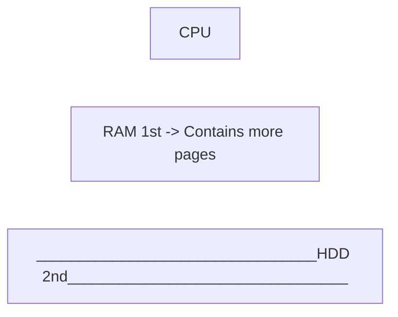
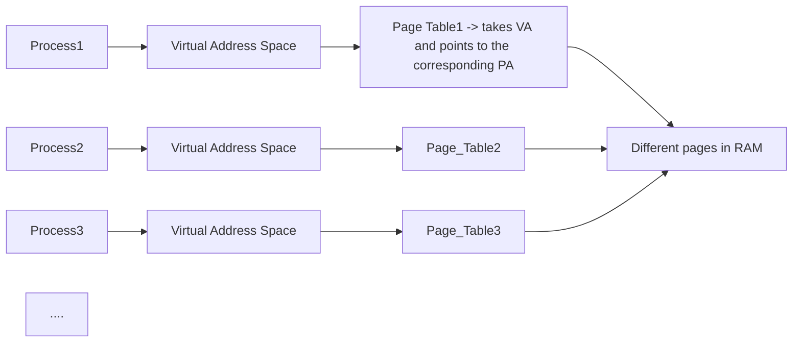

# Lab 12.0 Synthesis Reading Material. Memory Management + Annotations

Idea: we want to have processes to be able to write in each other's virtual address space.

## Process VAS (virtual address space)

Processes have a virtual view on the memory, so they "think" that all of the system belongs to them. That is done through HW mechanisms:
- memory mapping tables
- TLB
### Memory paging
> provide process ***memory isolation***, i.e. the processes' memory is protected.

### Shared memory
- in context of paging, the shared memory consists of contiguous pages

Memory mapped file = used to avoid having to call sysCalls for accessing the file contents. The memory area is backed by a file, s.t. when a process reads from there it reads file contents.

### Lazy loading 
=> a memory space will be allocated + loaded in physical memory, only when a process accesses it.

# How to map files in memory

```c
#include <sys/mman.h>

/*
* Calling process maps a part of the open file (fd) in memory
* @param addr = start of virtual address, NULL => any address
* @param offset = offset of the area in the file
* @param prot = protection of memory area 
* @param flags = MAP_PRIVATE, MAP_SHARED i.e. between processes
* @return = address where file was mapped (if addr was NULL), MAP_FAILED in case of err
*/
void *mmap(void *addr, size_t length, int prot, int flags, int fd, off_t offset);

/**
* unmap memory
*/
int munmap(void *addr, size_t length);
```

## POSIX API

```c
#include <sys/mman.h>
#include <sys/stat.h>
#include <fcntl.h>
#include <unistd.h>
#include <sys/types.h>

int shm_open(const char *name, int oflag, mode_t mode);
int shm_unlink(const char *name);
int ftruncate(int fd, off_t length);
```

## Program samples 
- in pdf

# More from @Istvan :battery:

- User mode: more processes
- Kernel mode: 1 process

OS manages resources for user mode (hardware allocation, **memory** and so on).

### Memory Hierachy
> Page = smallest memory unit used by the OS and Hardware (4kB)

.
.
---
.
.


## Memory Swapping

- extends RAM memory on the Hard Disk
- unused pages from RAM are temporarly stored to the HDD (that is also sliced into pages)
- we need another mechanism to manage the link between RAM pages and HDD pages

## Memory Mapping

- want to write a high performance program that works with files
- avoid using many read(..) write(..) sysCalls
- mmap(..) primitive. powered by:
  - swapping
  - laziness
- 2 possibilities of file mapping:
  - map files to memory (private / shared)
  - create shared memory (private / shared)

private = for writing use *copy_on_write*

copy on write -> e.g. two files share a mapped file. One process ones to write in a memory area of a private process. The page is taken as it is, is copied in another place, and the mapping for the writing process will be changed at the new location for that specific pace

shared ->

### Our focus: shared file / memory mappings.
- in the assignment we will use these ones (*1018 Linux Programming Interface*)
- the offset will generally be 0 (the entire file is mapped)
