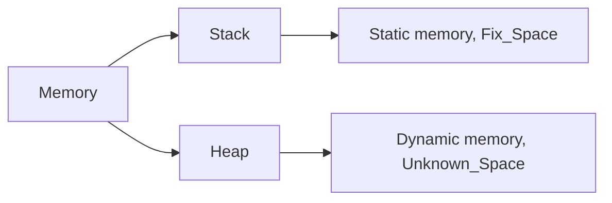

# Lab 3

Don't upload files in a zip (only .c files).

## Stack vs Heap



## Data Types & Pointers

* Declaring a matrix
```
//2D Matrixß

int** mat = (int**)malloc(10 * sizeof(int*));
for(int i = 0; i < 10; i++) {
  *(mat + i) = (int*)malloc(10 * sizeof(int));
}
```

## Compile vsCode 
```
gcc nume.c
# modify launch.json
./nume.c
```
- se creeaza 2 files .json
- tasks.json -> compilare -> argumente I/O
- in launch.json -> putem modifica argumentele

## Probleme

### - l03p4
Student vector:
- array de pointeri de studenti

Memory management:
- array de pointeri la struct student
- the whole structure is like an acyclic graph 
- cand eliberez memoria incep de la cel mai *"adanc"* nivel --> mergem în sus pe tree ulterior (altfel nu mai putem elibera nodurile mai adânci)
- În cpp memory managementul de face cu *new* și *delete*
- În cpp: at the end of the scope ({ }) we can't use the variables declared inside it


