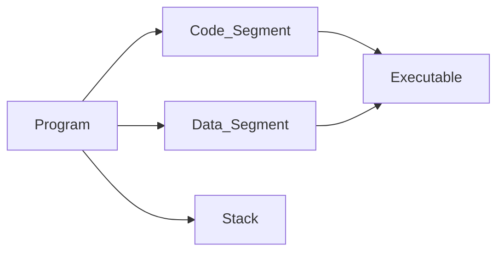
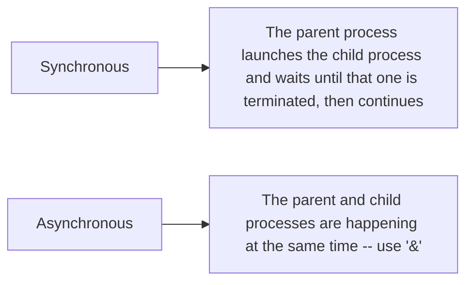

# Lab 6.0 Synthesis reading material - Processes
### Contents:
- processes
  - create, manage, sysCalls

*`annotations added`

---
## I. Processes

> ### Processes = entity used to represent a running program (running apps)

Process :link: Identifier (***PID***)

- Relationship between processes:
parent (creates) -> child (created)

- Note: PID = 0 => run time OS process

Remarks:
- child can't change parent
- if parent terminates before child => new parent of the child is process init (PID = 1)

### Process Groups
- group identifier **PGID**
- process :link: control terminal
> Daemon = process not associated to a control terminal

### Programs and processes

> Process = environment in which the program is executed
! The process cannot directly modify its system data (use sysCalls)

```
/etc/init // the ancestor of all possible processes on Linux
```
The user enters the system => shell process starts

## II. Fork ( )

> Linux Programming interfaceBook page 520

- the calling process (parent) (*A*) is created when fork is called => new process `*B* independent on *A*` is created but the contents of *A* and *B* are identical and concurrent

- **returns** the PID when is called from parent process, 0 for child, -1 in case no process is created

- child inherits: process variables, file descriptors, UID, GUID, PGID, environment variables;

- memory space of parent and child are separate, resources are inherited as values, but the child and parent eventually compete for CPU resources.

`* takes a process and clones it`
`pretty much Linux-specific` :penguin:
ß

## III. Exec ( )
- doesn't modify PID or so

- exists in more forms execl, execlp, execv, execvp 

- if we want to close all files after exec call => use fcntl( ) 
function 

- the only returned value is -1 ONLY in case it's unsucessful (e.g. wrong path)
`generally doesn't return anything`

- end in l / v $\pm$ 'p'

>Process :link: physical mem area => when fork is called, immediately after, the child points at the same phyical mem space.

>***Copy & write*** (happening at exec( ) call) mechanism allows child to modify data by copyin g the desired area in another mem location and performing operations there

```C
#include <unistd.h>

/**
* command args known when writing code
* receives a variable length arg list
*/
int execl(const char * path, const char * arg0, ..., NULL); 

/*
* receive an array of args from at runtime
*/
int execv(const char * path, char * argv[]); 

int execlp(const char * filename, const char * arg0, ..., NULL); searched in PATH env variable, cmd line args known -"-.

int execvp(const char * filename, char * argv[]);
```
.
.


> ### One needs to use fork ( ) and exec ( ) in a combined manner :white_check_mark:
.
.

## IV. Wait(s)
- parent process pauses and waits for the termination of a child (any for wait and a specific one for waitpid).
- the termination state of a child process can be found through the macros stored at address indicated by *pstatus*:

{WIFEXTIED, WEXITSTATUS, WIFSIGNALED, WTERMSIG}
- Details about the ways of termination at pag. 11 in lab 6 pdf.

```
#include <sys/types.h>
#include <sys/wait.h>
pid_t wait(int* pstatus); //return PID of terminated child, -1 err
pid_t waitpid(pid_t pid, int* pstatus, int opt); //
```

### Exit
- terminate calling process
```C
void exit(int* status);
```
  - codes meaning:
    - 0 - success, all good
    - != 0 - bad
- SIGCHLD - signal sent to parent when one of the children terminates

- Scenarios for exit:
  1. Parent terminates before child => *new parent (init process) for each child* 
  2. Child terminates before parent => parent gets info about termination through wait syscall,
  - no wait in the parent of the terminated process -> the terminated process is in **Zombie**
  :skull: state (verify using ps);
  3. Child whose parent is init terminates => the child doesn't become a zombie as init calls wait by default.

.
.
.
> ### Wait and Exit syscalls should be used together => *synchronization* & *communication* :white_check_mark:


### Command interpeter functionality



## Summary SysCalls
|Call|Explaination|
|-|-|
|getpid( )|returns the pid of the curr process|
|getppid( )|pid of the parent|
|setgrp( )| changes group of calling process to PID|
|getpgrp( )|find the group of the process|
|setpgrp( )|disconnect process from its terminal (inherited from parent) => new terminal|
|pid_t **fork( )**| create a new process|
|exec( )|ask kernel to load and start a program|
|exit( )|terminate current process and store termination code in a process table entry|
|wait( )||
|waitpid( )|


## Commands
|ps|list of current processes in Process Table|
|-|-|
|ls -U username|all processes belonging to an user|

