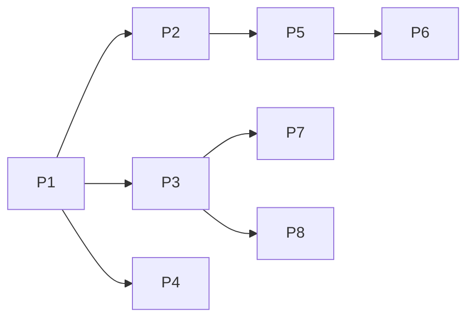

# Lab 6.1 Notes

### Quick assignment tip :blue_heart:
---
- alignment al structurilor
- pragma pack() :cool:
- declare valgrind as `true` :heavy_exclamation_mark:
- o sa ne puna un script pe teams care sa ia ce argumente se dau pentru un anumit test

- cand citim un int - Little Endianess 

```
01 02 03
=> 30201 citi
```

## Practical examples:
1. ... 
```
fork() // p1 branch (=> p2)
fork() // p1 branch (=> p3) & p2 branch (=> p4)

/*
|P1
|
|_________
|P1       |P2
|         |
|         |
|____     |_____
|P1  |P3  |P2   |P3
|    |    |     |
*/
```

### Docker:
- nota se da in functie de testele mai ok :smile:

## TO DO :white_check_mark:
- mainly - create process hierarchy
- Lab guidance:

> :cactus: Tip: define a function for each process when we work with process hierarchy :heavy_exclamation_mark:

  - Create process hierarchy based on the blackboard example (below)



# Lab Exam Code Examples

```c
/**
* How to...
**/

/*
* Create a new child process and wait for its termination
*/
    
    pid_t pid = fork();

    if(pid < 0) {
        printf("FAILED");
    }
    else if(pid == 0) {
        printf("CHILD PROCESS");
        exit(-1);
    }
    else {
        printf("PARENT PROCESS");

        int* ret_status;

        waitpid(pid, ret_status, 0);

        if(WIFEXITED(*ret_status)) {
            printf("\n[PARENT] Child exit code: %d\n", WEXITSTATUS(*ret_status)); 
        }
    }

/*
* Execute a command within a process
*/
    char* command = "/usr/bin/ls";

    //execl() needs the whole path

    execlp(command, command, "filename.txt"); //ret -1 if failed, no returned if success

```


