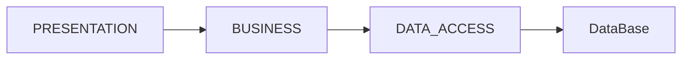

# Lab 7.0 Assignment Presentation

## Next Assignment
CRUD - aplication based on database
- blueprint for webApps
- do not matter too much the particularities of the classes

## Concepts
### 1. Layered Architecture
For a database app there are 3 major layers (could be packages in the project)


**PRESENTATION** 
- belongs to frontend 
- cand apasam un buton trebuie sa avem definita o functie in business layer
- apare validare de tipuri de date
- putem sa cream obiecte inca din presentation daca vrem

**BUSINESS LOGIC** - belongs to backend
- fiecare actiune are o clasa

e.g.:
ClientLogic.java (clasa)
```java
insertClient(Client c) {
  //validate the client data
  if(valid(c)) {
    ClientRepo.insert(c); 
  }
}
```
**DATA ACCESS (repository)** - belongs to backend + data engineering

e.g.:
ClientRepository.java
```java
insert(Client c) {
  //creates a query String populated with the client data
  String query = ...; //JDBC library used 
}
```

-> database at the botton

Beyond these classes, the model clases will link the layers. They are corresponding to each table (column -> field in class). Object -> Row in table

e.g.
Client.java
|ID|Name|Year|Address|
|-|-|-|-|

```java
class Client {
  int ID; //corresponding to a column
  String name; 
  int year;
  Strinf address;
}
```

```sql
INSERT into Clients
...
```

---
### 2. Database Connection 
- DB ruleaza intr-un server (DB Server), avem acces cu MySQL 3306 code
```
localhost: 3306 //adresa pe care ruleaza serverul de baze de date
```
- server app = calculator specializat cu resurse mai puternice / aplicatie care permit conexiune pe retea care deservesc cererile utilizatorilor.

### 3. Reflection Techniques
- ne ajuta sa avem informatii legate de tabel (nume, campuri) (le luam din clasa).
- putem sa facem queries generice pentru orice obiect.
- ORM framework (Object Relational Mapping) in practice care ne genereaza din clase baze de date (nu merge pentru queri-uri mai complicate).
- Field.get...

Clasele se "sparg" in functie de functionalitate: tot ce tine de Client este intr o clasa cu preficul Client.

### Singleton design pattern
- cum putem grupa clase s.t. se face o singura instanta dintr-o clasa.
- constructor privat (nu poti apela new)
- getInstance( ) public method.

e.g. 
```java
if(x == null){
  return new Class
} 
else { 
  return x;
} 

//x fiind obiect de clasa respectiva 
```
(wikisearch Singleton)

