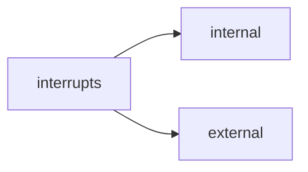

# LCD Shield and Interrupt System

# Reading Takeaways

## LCD Shield
---

Contains:
- LCD
- potentiometer

### LCD Controller: HD44780
- Instruction Register (send commands) + Data Register (buffer display data)

- The data to be displayed is stored in DDRAM  (display-data-ram)
	8-bit characters
	80x8bits capacity
	Use the rest as normal RAM when not full

- CGRAM (store user defined characters) 

- CGROM (store the shape of characters 8x5) as matrices of points
	- User defined characters can be between 0x00 0x07
	- one byte per row, LS5B will specified whether the pixels are on/off

- communication: 4 bit width for our shields

```c
//includes the LCD library
#include <LiquidCrystal.h>

/* LCD RS - pin 7
* LCD Enable - pinl 6
* LCD D4 - pin 5
* LCD D5 - pin 4
* LCD D6 - pin 3
* LCD D7 - pin 2
The 7-th pin of the LCD is connected to the display brightness
control potentiometer! */

// Init the LCD with the stated pin numbers
LiquidCrystal lcd(7, 6, 5, 4, 3, 2);
unsigned long time;

void setup()
{
	// Sets the no. of rows and columns of the LCD
	lcd.begin(16, 2);
}

void loop()
{
	// Read the number of elapsed seconds from the program
	//start
	time = millis() / 1000;
	// Set the cursor on col 0, row 0 (first row)
	
	lcd.setCursor(0, 0); //(row, col)
	// Write a string of characters
	
	lcd.print("Hello Children");
	// Move the cursor in the middle of the second row (row 1)
	
	lcd.setCursor(7, 1);
	// Display the elapsed time
	lcd.print(time);
}

```

```c
/*
* Example: generation of user defined characters
* This example shows the user defined character generation and 
* usage procedure
*/

#include <LiquidCrystal.h>
LiquidCrystal lcd(7, 6, 5, 4, 3, 2);
// Character matrix for the first character: every line is a
//row of pixels of the character
byte happy[8] = {
B00000,
B11011,
B11011,
B00000,
B00000,
B10001,
B01110,
};
// Matrix for the second character
byte sad[8] = {
B00000,
B11011,
B11011,
B00000,
B00000,
B01110,
B10001,
};

void setup() {
	lcd.begin(16, 2);
	// The 2 character are stored in the CGROM, user defined
	//area, pos. 0 and 1
	lcd.createChar(0, happy);
	lcd.createChar(1, sad);
	// Display the first line: a string followed by the 1-
	//stuser defined char
	lcd.setCursor(0, 0);
	lcd.print("Happy ");
	lcd.write(byte(0)); // See the difference between print
	//and write
	
	/* When you are referring the “0” user defined char you
	must write a cast to the “byte”
	type, otherwise the compiler throws an error. Exception
	is the case when you are referring a varaiable:
	byte zero = 0;
	lcd.write(zero);
	*/
	
	// Display the second line
	lcd.setCursor(0, 1);
	lcd.print("Sad ");
	lcd.write(1); // when you are referring other characters
	//then “0” it is not necessary to cast
}
void loop()
{ }
```

## Interrupt System
---

> Require immediate action from the microcontroller

Interrupt system:
1. Enable GIE bit
2. Init Stack
3. Run ISR


### External interrupts
8 available

### Where does the program go at interrupt?
- to an address defined in the interrupt vector table (for every interrupt)

EICRA

| |... |ISC11|ISC10|ISC01|ISC00| 
|-|-|-|-|-|-|


00 - pin is 0 
01 - change
10 - falling
11 - raising

### 1. Exercise
- trigger external interrupts using a button
- connect btn to the pin s corresponding to INT0 and INT1

```c
// Include the header for the avr interrupt system
#include "avr/interrupt.h"

// Include the LCD library
#include <LiquidCrystal.h>

// Init the LCD
LiquidCrystal lcd(7, 6, 5, 4, 3, 2);

volatile int buttonVariable; //public variable that can be
//modified by the ISR

void setup(void)
{
	buttonVariable = 0; // Init the variable shared between the ISR and the main program
	
	// Set the LCD row and col number
	lcd.begin(16, 2);
	lcd.print("Incepe experimentul");
	delay(1000); // perform a 1 sec delay to display this
	//massage on the LCD
	// Set pin 21 as input (the pin corresponding to INT0)
	pinMode(21 ,INPUT);
	// Set pin 20 as input (the pin corresponding to INT1)
	pinMode(20, INPUT);
	pinMode(13, OUTPUT); // Set pin 13 as output
	digitalWrite(13, HIGH); // Lit up the onboard LED
	delay(1000);

	/* Activate interrupts*/
	EIMSK |= (1 << INT0); // Activate INT0 - interrupt 0 
	EIMSK |= (1 << INT1); // Activate INT1

	/* Specify Triggering*/
	EICRA |= (1 << ISC01); // Specify INT0 triggering
	//behavior: falling edge of the ICS = interrupt control
	EICRA |= (1 << ISC11); // Same behavior for INT1

	/* Enable global interrupt system*/
	sei(); // Global interrupt system activation
	
	digitalWrite(13, LOW); // Turn off the onboard LED
	lcd.clear(); // Erase the LCD screen
}
void loop()
{
	// If an interrupt was triggered/executed the LCD has to
	//be erased and the main massage
	//displayed
	if(buttonVariable == 1)
	{
		lcd.clear(); // Erase the LCD
		buttonVariable = 0; // Global variable re-initialized
	}
	
	delay(1000);
	lcd.setCursor(0,0); // Set the LCD cursor
	lcd.print("Liniste…"); // Display a message
}

// ISR for INT0 (“INT0_vect” is a predefined name (address)
//for INT0 ISR
ISR(INT0_vect) {
	digitalWrite(13, !digitalRead(13)); // Change the status
	//of pin 13
	lcd.setCursor(0,0); // Move the LCD cursor in the top-left
	//corner
	lcd.print("Intrerupem");// Display message
	lcd.setCursor(0,1);
	lcd.print("ptr stirea zilei");
	buttonVariable = 1;
}
// ISR for INT1
ISR(INT1_vect) {
	digitalWrite(13, !digitalRead(13));
	lcd.clear();
	lcd.setCursor(0,0);
	lcd.print("Stirea Doi");
	buttonVariable = 1;
}
```

> [!note] Another option
> Use the functions `attachInterrupt(...)`, `detachInterrupt(...)` that encompass the lowlevel behavior defined in the previous example

```c
#include <LiquidCrystal.h>
LiquidCrystal lcd(7,6,5,4,3,2); //reserved for LCD
volatile int buttonVariable;

void setup()
{
	buttonVariable = 0;
	lcd.begin(16,2);
	
	lcd.print("A inceput");
	lcd.setCursor(0,1);
	
	lcd.print("din nou");
	delay(1000);
	
	// The 2 interrupt pins 21 and 20 declared as inputs with
	//pull-up resistors activated
	pinMode(20 ,INPUT);
	pinMode(21 ,INPUT);
	
	digitalWrite(20, HIGH);
	digitalWrite(21, HIGH);
	// Atach ISRs to the interrupts corresponding to pins 21
	//and 20 (INT0 and INT1)
	attachInterrupt(digitalPinToInterrupt(20), functieUnu, RISING);
	attachInterrupt(digitalPinToInterrupt(21), functieDoi, CHANGE);
}

void loop()
{
	// Insert here task for normal program flow ….
	lcd.print("Programul principal");
	delay(1000);
}
// First ISR function
void functieUnu()
{
	lcd.clear();
	lcd.setCursor(0,0);
	lcd.print("Functia Unu");
}
// 2-nd ISR function
void functieDoi()
{
	lcd.clear();
	lcd.setCursor(0,0);
	lcd.print("Functia Doi");
}
```

# ToDo:

1. Examples Run
2. Need to create an animation that indicates the time elapsed
	- [x] Done
3. Timer using interrupts
	- [ ] Done
	- Use attach interrupt
5. 2 + 3
6. Generate signals of different frequency and duty cycle and measure them with another board