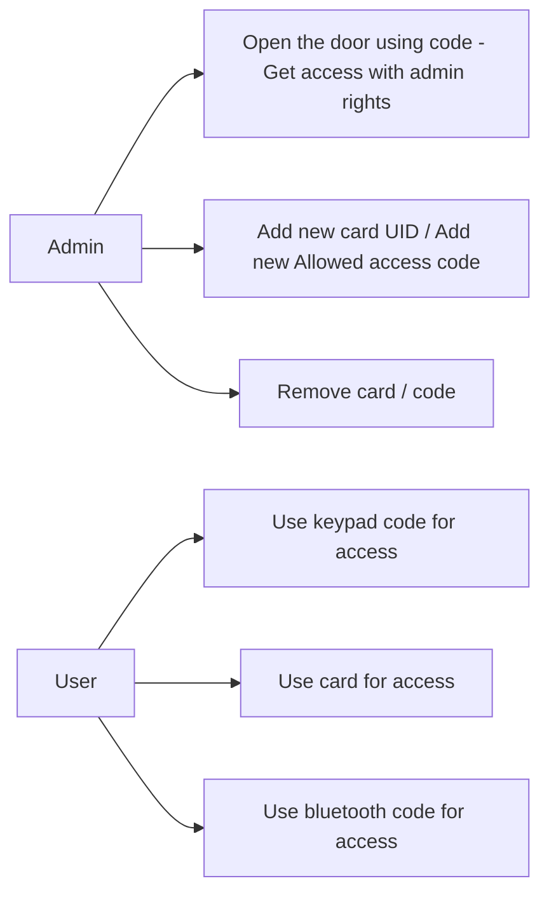

# Program logic 🧠
 
## Organisation logic
- state machine-ish
- use interrupts (not busy waiting)

### Roles:

# Modules of the project:

## Proximity Sensor + Keypad + RFID

> Integrate the keypad + RFID

- [x] Integrated LCD + RFID + Proximity
- [ ] Added Keypad
- [ ] Added EEPROM

### EEPROM
- store the current number of codes in an int at the beginning of the eeprom
- store the UIDs of users that have access (fixed len)
- retrieve the array from the eeprom at the beginning of the program execution
- save the array updated if there is the case

## Bluetooth "requests"

> Add the bluetooth logic on top of the f2f actions