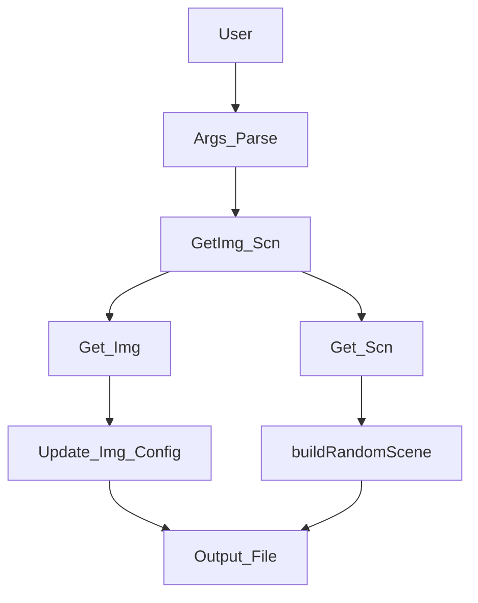

# Problem Description

> [!info] Problem
> Implement parts of a ray tracing algorithm using haskell 🌤. Don't put too much effort in error handling, user interaction, etc.

### Editable files
- src/Scene/Loader.hs
- src/Args.hs
- src/Image.hs
- src/Scene.hs
no other file

### Non-Editable Files
- Parser.hs - interest - library of parser combinators (use in Loader.hs and Image.hs)

All test fail
- ok
- use groups to test certain features of the app

- [ ] Understand existing code

### Concepts to clarify:
- parsers

> [!important] Parsers
> take unstructured input and return structured data (parse tree)

> [!important] Parser combinators
> - take existing parsers and use combinator functions to combine them
> - `andThen` - chaining
> - `orElse` - choice
> - `pMap` - transform
> - `many / some` repeate

App main procedure:

# Assignments

## 1. Argument Parsing (Args.hs)

### 1.1 `toArgMap`

- [ ] Done

### 1.2. `getArg` `readArg`

- [ ] Done

### 1.3. `procArgs` 

- [ ] Done

## 2. Parser Combinators (Loader.hs)

### 2.1. `vecParser`

- [ ] Done

### 2.2. `colorParser`

- [ ] Done

### 2.3. `imageParser`

- [ ] Done

### 2.4. `materialParser`

- [ ] Done

## 3. I/O and monads (Image.hs Scene.hs)

### 3.1. `loadImageConfig`

- [ ] Done

### 3.2. `getImageConfig`

- [ ] Done

### 3.3. `loadSceneConfig`

- [ ] Done

### 3.4. `getSceneConfig`

- [ ] Done