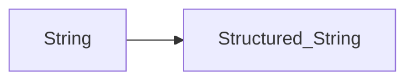

# Parser Combinators

- a strong point of haskell is for Compilers (Elm compiler)

## Parsers

> take unstructured input (string) and turn it into structured data (parse trees)



```haskell
type Parser a = String -> a -- not final

-- >
data ParseResult a = Success a String | Error String deriving (Show)

-- >
type Parser a String -> ParseResult a


-- Definition
data Parser a = Parser {numParser :: String -> ParseResult a}
```

Next up, the parser is updated an adapted for various purposes such as:
- the `satisfies example`


## Combining Parsers
- take one or more parsers and transforme them
- using combinator functions

### Chaining
- `andThen`  - take 2 parsers and create a sequencing effect (run first - is Success run second on the rest of the input)
- `orElse` - choose from the parsers
- `pMap` - transform parser A in parser B - can create special parsers `parseInt`
- `many`  (0 or more) `some` (at least a)

### Exercises
- parser functions - simpler than they seem
- between

