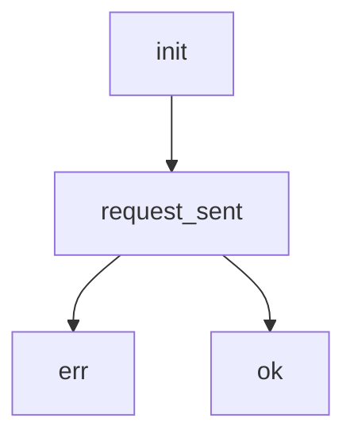

# Web intermmediate

# Elm Assignment Info

>[!warning] Deadline: 4 December

- we will write a decoder for the JSON file

---
# Elm Test

- should know lab 5 6 7 (should know previous stuff as well)
- including web

> [!note] Next week test

---
# Reading Material Takeaways

## Getting input
---
### Input fields
- `onInput` function

### Checkboxes
- `onCheck` function

## HTTP Requests
---
- internet functioning protocol
- client - requests data
- server - sends data


### App structure



### JSON
- key-value pairs
- in elm 
```json
{
	"a": 123,
	"b": {
		c:[1,2,3] //nasty
	}
}
```

```elm
field "a" : int
field "b" (field "c" (list int))
```

# To Do
 - 7.1.3 (not mandatory)
 - 😎șmecheria supremă `List.identity`