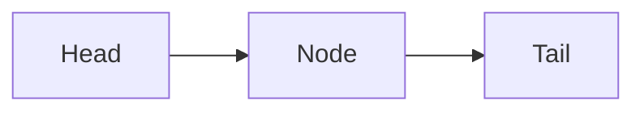

# Function types
---

### Functions are *also types* and `first-class citizens`

```haskell
not :: Bool -> Bool --must specify all types
```

### Curried Functions

>[!note] Curried function 
>takes arguments one at a time (default in haskell).

Why?
	- get a function s result

> -> operator when defining types is right-associative

$\Rightarrow$ curried functions are left-associative

### Recursive types
- use the type in the definition of itself

- use keyword `Empty` for stating that there are no components

  ### Arity
 - of function (number of arguments)
 - of types (number of constructors)

# Expression Evaluation
---
- important topic 💛(feel)

> [!NOTE] Call-by-value 
> means that the arguments of the functions are first evaluated and then used. Used in ***ELM*** (eager)

> [!important] Call-by-name
> means that the evaluation is done ALAP. The expression is just "copy-pasted" in the function implementation. Expressions are evaluated just when needed

> [!REMARK] Call by need 
> = Lazy Evaluation used in ***Haskell***.  Allows infinite structures

Thunk = ...

- Call by need useful when wanting to avoid heavy computation (evaluation is not done until `needed`)
- Make sure functions are correctly defined (no infinite procedures)

Pitfall of Lazy eval:
- too much computation (example with summing the elements in a list)

### Solution: strict application (`$!`) in haskell

- if the code is compiled using optimization options but `we` should add strict evaluation when needed

# Lists
---

> List = ordered pair or empty



```
[1, 2] is equivalent 1:2:[]
```

"Cons" operator `:` is right associative and used to build lists

```haskell

-- Operations on Lists TODO

my_length [] = 0
my_length (_:xs) = 1 + my_length xs

--

infix 4 ++++
[] +++ ys = ys
...

take -- take first 

rev

rev1

sum

minimum

flatten -- interesting and can be applied on multiple levels

zip

unzip

zipWith -- use higher order functions

map -- perform function on each list
```

### Pattern matching
- the interpreter analyzes that the function is defined on all cases that can be encountered

### Association lists
- pairs (key, value)

```haskell
assoc (x, (y, z):lp)
```

### Styling
- guarded equations (better than ifs, already lovin' it 💘)

```haskell
myelem e []
myelem e (x:xs) | e == x = True
				| otherwise = myelem e xs --default guard
```

```haskell
--cool
map (map (2*)) list_of_lists 
```

