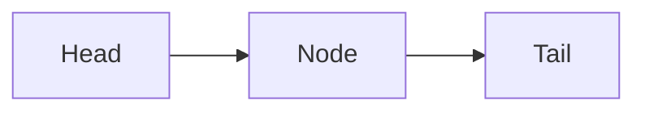

# Function types
---

### Functions are *also types* and `first-class citizens`

```haskell
not :: Bool -> Bool --must specify all types
```

### Curried Functions

>[!note] Curried function 
>- Takes arguments one at a time (default in haskell).
>

Why?
	- get a function s result

> -> operator when defining types is right-associative

$\Rightarrow$ curried functions are left-associative

### Recursive types
- use the type in the definition of itself

- use keyword `Empty` for stating that there are no components

  ### Arity
 - of function (number of arguments)
 - of types (number of constructors)

# Expression Evaluation
---
- important topic 💛(feel)

> [!NOTE] Call-by-value 
> means that the arguments of the functions are first evaluated and then used. Used in ***ELM*** (eager)

> [!important] Call-by-name
> means that the evaluation is done ALAP. The expression is just "copy-pasted" in the function implementation. Expressions are evaluated just when needed

> [!REMARK] Call by need 
> = Lazy Evaluation used in ***Haskell***.  Allows infinite structures

Thunk = ...

- Call by need useful when wanting to avoid heavy computation (evaluation is not done until `needed`)
- Make sure functions are correctly defined (no infinite procedures)

Pitfall of Lazy eval:
- too much computation (example with summing the elements in a list)

### Solution: strict application (`$!`) in haskell

- if the code is compiled using optimization options but `we` should add strict evaluation when needed

# Lists
---

> List = ordered pair or empty

### Define list like the way we process it



```
[1, 2] is equivalent 1:2:[] -- that's how we process it as well
-- the first option is a syntax sugaring
```

"Cons" operator `:` is right associative and used to build lists

```haskell

--- Functions and operations using lists

maxl [1, 2, 3]
	 -- return max of a list
	 -- remark use {} to write on multiple lines
	 -- compare 2 elements and keep a list including 
	 -- the max of the two and the rest of the list

---

infix 4 +++ --perform append
[] +++ ys = ys
            -- append takes O(k) when k is length of the first list
---

take k [] --extract k number of elements

---
drop

---

rev -- O(n^2)

---

rev1 -- Tail recursive (O(n))

sum

minimum

flatten -- interesting and can be applied on multiple levels
        -- Flatten 1 level each call

---

elem e [1, 2, 3] --check if element is in the list

---

zip list1 list2 -- works like a qipper
                -- returns all lists containing pairs 
                -- of the elements at each index

unzip -- opposite of zip
      -- returns 2 lists

zipWith (*) [1, 2, 3] [4, 5, 6] -- use higher order functions
   -- use function on pairs of 2 elements 1 * 4 then 2 * 5 then 3 * 6


map (2*) [1000, 2000, 3000] -- perform function on each list
```

### Pattern matching
- the interpreter analyzes that the function is defined on all cases that can be encountered

### Association lists
- pairs (key, value)
- need to have means of comparing the searched element with the key
- linear searhc is performed

```haskell
assoc (x, (y, z):lp)
```

### Styling
- **guarded equations** (better than ifs, already lovin' it 💘)
- need to write this way whenever possible
- idiomatic way of writing to facilitate reasoning (support theorem provers)

```haskell
myelem e []
myelem e (x:xs) | e == x = True
				| otherwise = myelem e xs --default guard

-- the return value corresponds to the first equation
-- otherwise is the default guard
```

```haskell
--cool
map (map (2*)) list_of_lists 
```

