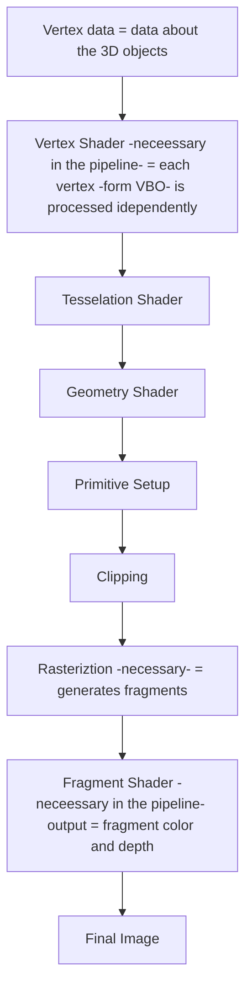

# OpenGL Pipeline

# Reading Material Takeaways

>[!note] Our goal: Programmable Pipeline
>offers the developers the flexibility to customize the graphics pipeline

## Where is data stored?
- Vertex Buffer Objects
- Vertex Array Objects

OpenGL operation $\to$ large **State Machine** 

`Shaders` - programs (i.e. lighting) allow us to use the GPU at the full capacity written in GLSL

## Graphics Pipeline

### Representing 3D objects
- Vertices + Topological Info (position, color, texture, ...) (vertices and triangles)
- Stored in VertexBufferObjects $\in$ VertexArrayObjects
- need to generate VBO, bind them and load data

### In Vertex processing stage: model, camera, projection transformations

### Vertex and Fragment Shaders
- necessary for rendering 3D objects
- we will have as input additional information (depth, texture, ...)
- need to generate shader objects, attach and compile them to create the VP and FP modules
- then they need to be combined in a shader program (create $\to$ attachShaders $\to$ linkPrograms)

# Lab Work

### In a OpenGL Application
Setup:
1. Specify a Triangle
2. Initialize OpenGL Objects
3. Analyze, compile and link the shader Programs
4. Specify the rendered primitive

### Assignments:
1. Display 2 triangles that form a square
2. New fragment shader with a green color
3. Link the shader to render triangle by using keyboard inputs