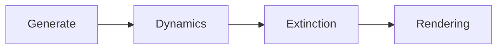

# Model 3D Object cont'd

## Previously discussed:

- **Implicit functions**
	Mathematical, resource intensive for computations
	- High Graphics Quality
	- Use cases: cartoons, scientific representations
	
- **Polygonal mesh**
	E.g. use triangles to describe shapes
	- Boundary representation - tree going from object downto details
	- Before rendering, round the edges: `Linear/Curve Interpolation` of attributes
		The vertices representationc hosen depends on the chosen applications. (should support the procedures we want to apply to the 3D object)

> [!important] Important
> - we should analyze the relationship between choosing an approach and the goal

> [!note] To get accurate modesl
> Use mathematical representation

- **Bicubic parameter patches** - B-Spline
	- Use pairs of curves to describe surfaces
	- Parametric equations describe them
	- Curves are Described by ***control points*** (sometimes it doesn't pass through the surface points)
	
- CSG - **Constructive Solid Geometry**
	- Use basic objects (combined with boolean operations + - ) to build the complex one + Model transformations
	- Can use for difficult objects (hard to model using other ways) (🧀)
	
- **Octree Representation** 🟦
	- Describe shape by a cube divided in smaller and smaller cubes
	- Finally have tree with nodes with 3 types of values (Empty, Partially Full, Full FULL)
	
- BSP Trees - **Binary Space Partitioning Trees**
	-  A tree - use a procedure of interpreting the tree when rendring
	
- **Procedural modelling**
	- Generate object by executing a procedure
	- E.g. Fractals - characterized by fractal dimension = start from unity dimension, then generate details following a set of rules (maths/grammar/etc.)
	- The dimension of the object does not grow, but details are added
	- Used for complex and somewhat random books: e. g. 🌲⛰🌿

# Today

## Fractals cont'd

Idea: generate a curve that fills in a polygon (proved that it can be done by a maths geek)

### Lindenmayer - L-system grammar ✒

> [!Note] Idea
> Generate shapes using just rules
> e.g. like in real trees - there is a certain rule 🌳


- Generate fractals using this kins of grammars
- FERNS!

```
# Example: Generation
#
# + means left
# - means right
#
# Procedure for a tree

W -> F
F -> FF +[+f-F-F] -[-F+F+F]
```

> [!question] Questions
> Could we add noise to this grammar?
> Can the whole logic of the shape evolution be encoded whithin the initial grammar?

> [!tip] Use python Turtle library to create fractals

---

## Procedural modelling
- can model fire, grass, cloth, fluid-like etc.
- Particles are freely moving

Can describe connections between particles. 



- computation intensive for many particles
	- Use models that describe particles&connections

### Mass-spring particle model

Create a network having several types of topologies ()

- arc and particle
- Use Hooke's law (physics)
- can model 3d networks - i.e. human body

Can define operations:
- cutting
- sewing
- breaking
- interaction with other objects (e.g. clothes on a human)

Issues: 
- find ways to accelerate computation
	Solutions:
	- separate simulation from rendering
	- use 2 cpu s to parallelize the simulation

## Examples

### Physical vs Mathematical model

e.g. Rock rolling down the hill:
a. Math model:
	define hill as set of polygons
	define movement of the rock (velocity, direction, ...)
	compute the forces of interaction, etc.
	compute from the start everything that will happen

b. Physical model:
	physically describe laws
	place objects in their initial positions
	leave the sistem run based on the defined laws
	nature-like


Tool: Box2D