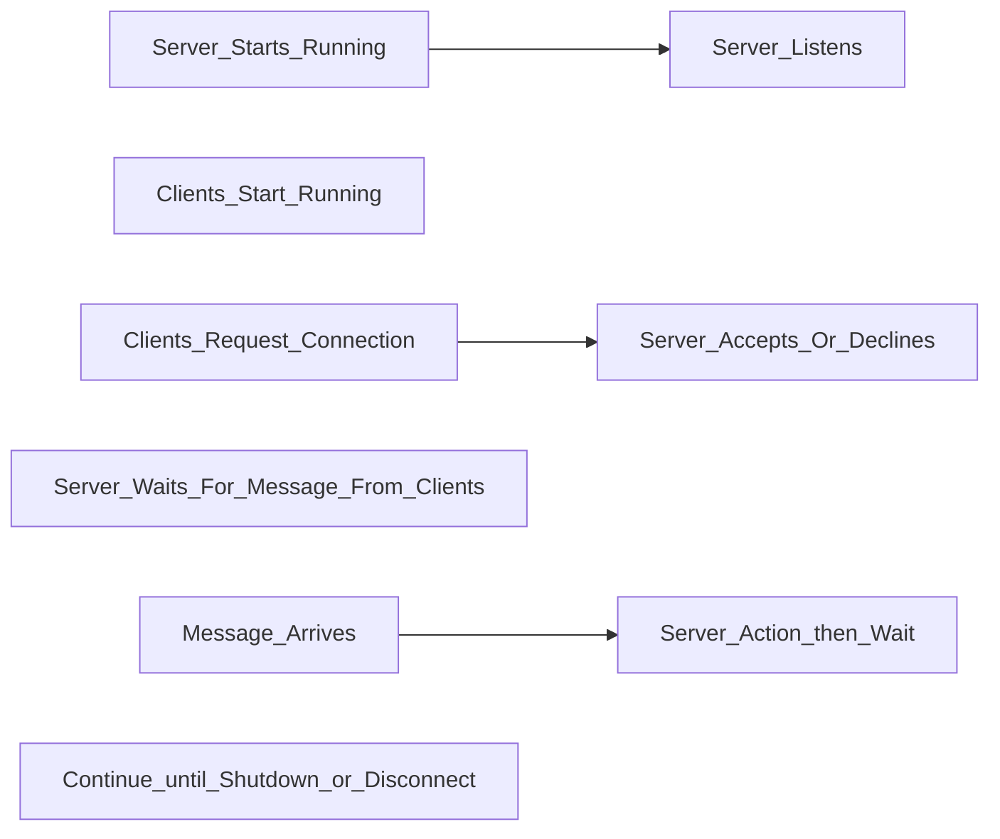

# Lab part

## Ch. 3 Basing Software Development on Reusable Technology

### Key concepts:
- Reusability
	- Ideas:
		- Probles induced by reusability of software: Quality issue

- Framworks
	- Ideas:
		- API = sevices provided by framework
>[!Note] Framework
> A framework is reusable software that implements a generic solution to a generalized problem.
>     - In OOP it is a library of classes

- Product line:
	- Results of using frameworks

- Framework types:
	- Horizontal
	- Vertical

- Client-Server Architecture
	- Typical to distributed systems
	- Servers
	- Clients
	- Communication protocols


- A sequence diagram describes better

- Client-server apps design steps
	1. Individually design client and server work
	2. Distribution of work
	3. Types of messages between them
	4. Mechanisms for init, connect, send/receive msg, terminate

- Technology Requirements:
	1. IP
	2. TCP
	3. IP and hostname
		- server identified by port number (known by client and server)

- Practical example for Java
```java
//use java.net package
package java.net

//server init and listen
ServerSocket serverSocket = new ServerSocket(port);
Socket clientSocket = serverSocket.accept();

//client to server connect
Socket clientSocket = new Socket(host, port);

//Communication
/**
* InputStream -- receive info from other program
* OutpuStream -- send to other program
*/

package java.io

output = clientSocket.getOutputStream()
```