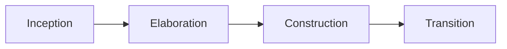

# Lecture Two

 Exploring software development approaches

## Unified Process 🟨

Heavyweight approaches - less often employed

Used for large software systems

- developed in conjunction with the UML 

- is use-case driven

	- in practice we will practice a rather agile approach

### Core principles:
- reuse components

### Phases in the UP:

> [!Tip] Develop an architecture first based on use case and then extend it (use as a blueprint)

## Agile Development 🟦

Lightweight approaches

> [!NOTE] Read courses by myself
