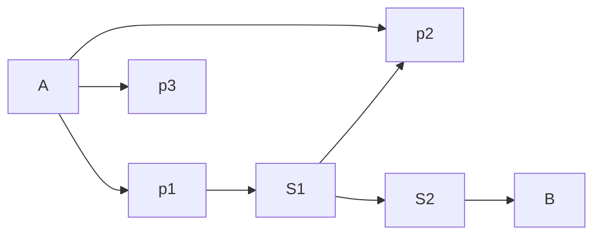

- Come from Data Science, AI
- Unsupervised Learning Technique

## Types

### Content based
- parameters - movie examples

### Collaborative filtering
- opinions of other users - movie examples

### Hybrid 
- combination of the two above

### Data mining

### Neighbourhood based


# Problem
- recommend a top of three choices of stations for the user to get from point A to point B

> [!important] Port
> Inputs: `coordinatesStart, coordinatesEnd`
> 
> Outputs: 
> 	`station1A -> station1B` 
> 	`station2A -> station2B` 
> 	`station3A -> station3B`

Factors to consider:
- time added by traffic of the cars
- time added by traffic of bikes
- admin-goal: balance the load of the stations

> [!question] Does this problem fit in the category of the recommender systems?

### Resources:
- http://www.vldb.org/pvldb/vol7/p1549-wang.pdf
- https://github.com/microsoft/recommenders
- https://github.com/grahamjenson/list_of_recommender_systems 

### The model of our system
- graph - our model

We know:
- distance between stations: $d(S_n \to S_m)$ measured in time (traffic)
- distance between coordinates (consider euclidean distance between points) measured in meters/cm
- number of bikes on the way between  $(S_n, S_m)$
 


```
   1 2 3 4 5 6 7 8 9 10 11  
  #########################
1 #  S           A        #
2 #                  S    #
3 #                       #
4 #   S                   #
5 #                  S    #
6 # S                     #
7 #            S        B #
  #########################

S - station
A - start point
B - finish point
```