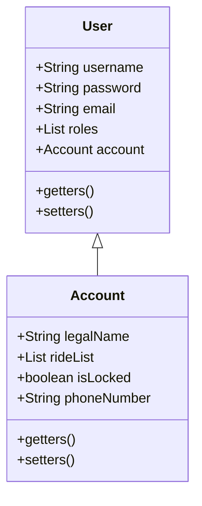

# Backend
- Account model class associated to user
- GET to retrieve user data into the frontend

- Modify signup to sign up accounts + users (?)

> [!info] Inheritance in Entities
> Some magic happens in the case of entities that inherit from other entities. When saving a child, both tables mirroring the child and parent entities are modified (each with its own fields) 😲

- [x] Show Details

- [x] Edit details (Update)
- [ ] Show active rides (maybe different folder)
- [x] Delete Account

# Frontend

> [!important] Issue for PUT
> - investigate
> - done

- [ ] Show rides in a foldable container
	- [ ] style container
	- [ ] display and populate table from backend

