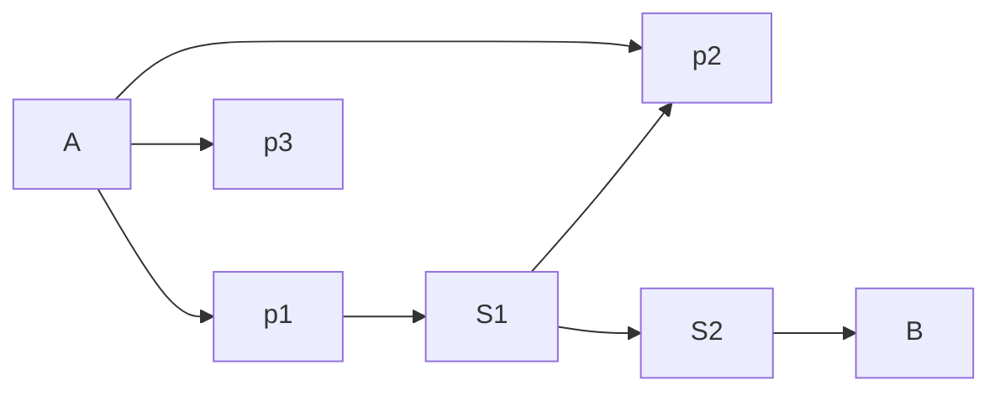

# Generally about the systems
- Come from Data Science, AI
- Unsupervised Learning Technique

## Types
- Content based
	- parameters - movie examples
- Collaborative filtering
	- opinions of other users - movie examples
- Hybrid 
	- combination of the two above
- Data mining
- Neighbourhood based

## Resources
- [Slides](https://bendersky.github.io/res/TF-Ranking-ICTIR-2019.pdf) - TensorFlow Ranking System https://github.com/tensorflow/ranking/
- 🌟 http://www.vldb.org/pvldb/vol7/p1549-wang.pdf - combines existing information on the road system with a search algorithm 
- https://github.com/microsoft/recommenders - list of tools
- https://github.com/grahamjenson/list_of_recommender_systems - list of tools
- https://ieeexplore.ieee.org/stamp/stamp.jsp?tp=&arnumber=6816730
- https://lhpeurope.com/cycling-paths-recommendation-system/ - just a concept
- see [CrowdPlanner-Bibliography]  - use information from users to combine the route recommendation algorithms and crowd feedback (with recommender)

## Bori Resources
Algorithms for computing routes
- [https://ojs.aaai.org/index.php/AAAI/article/view/5396/5252](https://ojs.aaai.org/index.php/AAAI/article/view/5396/5252)  
- [https://patents.google.com/patent/US9261376](https://patents.google.com/patent/US9261376) 
‌

# Our Problem
- recommend a top of three choices of stations for the user to get from point A to point B

> [!important] Port
> Inputs: `coordinatesStart, coordinatesEnd`
> 
> Outputs: 
> 	`station1A -> station1B` 
> 	`station2A -> station2B` 
> 	`station3A -> station3B`

Factors to consider:
- time added by traffic of the cars
- time added by traffic of bikes
- admin-goal: balance the load of the stations

> [!question] Does this problem fit in the category of the recommender systems?

### Resources:
-

## What is out there already

### Route mining / recommendation algorithms:

# The model of our system
- graph - our model

We know:
- distance between stations: $d(S_n \to S_m)$ measured in time (traffic)
- distance between coordinates (consider euclidean distance between points) measured in meters/cm
- number of bikes on the way between  $(S_n, S_m)$
 

---

# Meeting Details - 👩‍✈️ Bori
### Proposals
- Using Recommender
	- Search algorithm (Dijkstra)

- Search Algorithm using multiple criteria
	- a series of sorts

