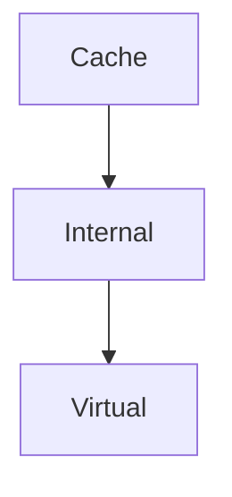

# Memory

 - one of the 5 items to create a computer

> [!info] Role
> - maintain Instruction codes and Data during execution

## Types - Von  Neumann perception - :
- Registers (fastest) - limited nr in the CPU
	- limitation caused by the need to manage the registers fast (pocket analogy) - we need *fast access* (1 clk period or less)
- Main memory (internal)
	- semiconductor circuits
	- random access (access based on an address - any location any time)
	- access time (1-70s)
	- handled directly (ASM instruction have access to RAM)
- External memory
	- controled via I/O interface
	- a transfer needs to be done between external and main memory
	- random access at sector/block level - but inside we need to read data in a serial way (`also in SSD?`)
	- access time high (for optical), smaller for semiconductor memory (SSD)

## New Types - innovation - :
- Cache memory
- Virtual memory

Hierarchy:

> [!goal] Goal: Analyze these concepts

## Classification of semiconductor memory

### Volatility
- ROM - non-volatile
	- ROM - programmed in manufacturing only
	- PROM - can be programmed by the user ONCE
	- EPROM - multiple erase-program operations (limited nr of cycles tho around 100)
	- EEPROM - use electrical energy to perform erase-program operations

> [!info] The name ROM is not really accurate as we can program it

- RAM - volatile
	- SRAM - static a.k.a. - preseve data as long as power is supplied
	- DRAM - dynamic - a.k.a. - may lose content of memory in time (need to refresh it periodically )

> [!important]
> - ***2ms*** is the time interval when memory is lost-

> [!info] Once again the name is misleading as ROM is also Random Access

### Access
- address-based
- associative memory (Caches) - find info based on a `tag` or `descriptor`
- stack - access top

## Design

### Communication MEM-CPU
1. Parallel bus (parallel data lines) - Asyncronous / Synchronous (P6)
2. Serial bus (I2C, SPI) - microcontroller specific

### Organization
- uniform access - all locations are treated the same way
- non-uniform - some are *more equal* than the others (*more* connected) 🐷 NUMA

## Basic concepts
- cell 
	- smallest storage element (1 bit) - state of the signal
	- implementation: 
		- FlipFlop (2,4,6 transistors) - SRAM (place the CMOS as a resistor for 2 components and CMOS as transistors for 2 components + 2 transistors for connecting the flip flops with the data lines)
		- Condenser (DRAM) - condenser (implemented by CMOS transistors) charged => 1  | discharged => 0
			- 1 transistor required for the cell (therefore DRAM allows higher circuit capacity)
			- because of leakeage the condenser is discharged => in every reading the capacitor is recharged)
		- conductor/isolator (ROM) - presence of absence of a transistor (programmed only once during manufacturing by placing or not the transistor)
			- for PROM the transistor is placed but the connection is made through a fuse-able element => program only once
			- EPROM - the fuseble element is implemented through a combination of 2 transistors - high voltage => conductor, low voltage => isolator. 
			- EEPROM/FLASH - use eletrical energy to delete the data from specific locations (no need for external energy - uv lamp)
		- magnetic polarization
		- transparent/opaque surface
- location
	- number of memory cells (multiple of 8)
	- accessed by an address (multiple of 8 usually)
	- can be read/written

#### Memory structure - Block
- location one after the other (linear)
- address for every cell

ROM, SRAM

#### Matrix organization
- location is at intersection line-column
- therefore, we need to generate in a multiplexed way the row address and a column address

DRAM

### Internal structure (normal)
- MEMORY location
- Data amplifier
- Address decoders (select locations inside memory) - select a single location
- control unit - decide to select a chip

### Transfer of data
- time diagrams:

Read: 
- need to get a valid address
- *then*, the chip select has to be activated (logical 0)
- *then*, data memory produces valid data - present as long as CS is active

`Access time - [Address valid, Valid data]` - important as it signals the speed of the memory/processor that needs to acces that memory chip

`Time cycle - [Valid address, Invalid address]`

Write:
- need to produce valid address
- *then*, data is put on the buss
- *then*, the write signal is activated
- *then*, the chip select is activated

`Access time - [Valid address, Write signal + Chip select signal active] ` - 15 ns

### Internal structure DRAM
- row decoder
- column decoder

Row address is put on the address line => row is activated and data goes to data multiplexer
Column value selects the DATA Mux
Control: when Row-Address-Select and Column-Address-Select signal

- multiplexing reduces number of address lines by 2 and the dimension of the circuit

#### Time diagram

Read
- generate row address
- activate RAS then put the column address
- activate the CAS  then get the valid data

`Access time - [Row valid, valid data]` - more complex - access time 70 ns (recent ones compare to the SRAM)

> [!warning] Remember the access times 
> - seem important for the prof.
> - mentioned in slides

Write
- the same but activate the write signal before generating 

Refresh:
- every 2 ms visit all rows of that memory (not each location
- generate row address and activate RAS

>[!question] Question
>- do we need to read all rows? a.k.a. give the address of all rows?

## Parameters
### Access time
$$t_{access} = t_{address-decode} + t_{cell-read/write} + t_{enable-amp}$$
- measured from the moment the address lines are stable until the data is read/written to memory

Maximum internal memory - $2^{40}$

### Capacity
- measured 

>Study 
>- my own organization in laptop (64bit organization or 64 cells) -> to express in number of locations divide by 8

- DRAM - per chip 2-8GB
...

## New DRAM

DRAM is the good choice as we can obtain big capacity at small prices.
- tradeoffs - multiplex, speed (for old ones), refresh cycles

### Inovations to reduce access time

Main idea: block reading (blocks from the cache are equivalent to rows in the DRAM)

- **FPM DRAM** - fast page mode
	- instead of generating the row and column address, read and write sequentially location adter location (don't re-send the row, only the column) therefore the other access times after the first one have reduced access time
	- page mode a.k.a. access blocks of memory
	- initially used for Video memory
- **EDO-DRAM** - cancels the delays between the data output (enable data output)
- **BEDO-DRAM** - burst
	- use both rising and falling edfes of the singnal
	- column addresses are generated in-chip (not processor)
- **SDRAM** - synchronous DRAM
	- before the transfer was done async
	- here, everything happens according to the clock
	- add logic to memory to allow it to check the clock and send data every clock period
	- promote burst transfer -> the address is not decoded again for the same row (when one block is read, the next ones prepare data for next accesses)
	- Time diagram:
		First rising edge, read command and address is sent
		Next rising edge - nothing
		Next rising edges correspond to new data ($D_{n + 1}$) at each step
		We can call for another read before all data is sent back
	- big 🧠 memory: compute addresses + evaluate states + keep track of the clock
- **DDR SRAM** - use both edges of clock for synchronizing (double data read)
	- better than using a double freq clock
	- strict timing conditions
	- the voltage between logical 0 and 1 is reduced
	- often we encounter errors => there is error detection and correction mechanisms (on the bus)