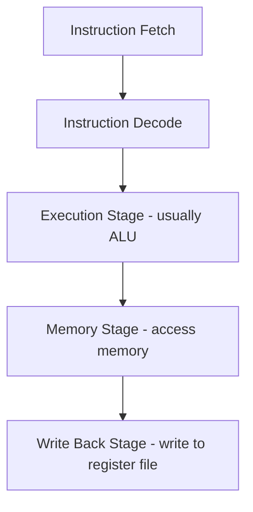

# 🌋 Hazard Detection and Avoidance Unit
---

# Pipeline Recap:
---

> Based on the CA book

## Stages:

## Possible hazard issues 🌠:

### 1. Structural (already solved)

 > [!INFO] Because of resource dependency

>Solution:
>- independent Instruction and Data memory
>- Asynchronous reads
>- RF write in the $1^{st}$ half and reads in the $2^{nd}$ half of the clock cycle

### 2. Data

>[!Info] Use data before it's ready
>RAW hazards
>The currently executing instruction is dependent on an earlier one still in the pipeline

> Solution: Add extra hardware
> - Hazard detection
> - **Forwarding Unit** (additional control signals and data is forwarded through the unit that looks pretty much combinational)
> - Special case for **Load Data Hazards** (need stalls): **Hazard detection unit**
	- instruction reorder (can I do this, not sure tho)

![[Pasted image 20221010085856.png]]

More Details About Solving Data Hazards are Described in 4.7

### More details
- detecting dependencies
- how a Forwarding unit is implemented
- how the Hazard Detection Unit is implemented (to detect hazards and insert stalls)

### 3. Control

>[!info] Related to flow control
>A.k.a. branch hazard

**Solutions**:
-  flushing
- Branch prediction
	- can predict - always not taken (stall if the branch is taken)
	- predictors based on previous behavior
- Delay branch slot (used in MIPS architecture)

> [!Question] Can I use the prediction algorithms

More is described in dection 4.8

### More Details:
- Assume branch not taken - vague
- Reduce Delay of Branches - add IF flush (linked to assume not taken)
- Dynamic branch prediction - use a Branch Prediction Buffer to check whether the previous branch has been taken - implementation not provided

![[Pasted image 20221024081820.png]]

DBP Techniques:
- [Correlating Branch Prediction](https://www.geeksforgeeks.org/correlating-branch-prediction/)
- [Global History Branch Prediction](https://www.researchgate.net/publication/334469536_Implementation_of_Global_History_Branch_Prediction_Using_MicroBlaze_Processor)
- [Branch Prediction Buffer]()
- [Branch History Table]()
- [Tournament Branch Prediction]()

Patterson slides:
- https://people.eecs.berkeley.edu/~pattrsn/252S01/

Might want to watch:
[Control Hazards YouTube Video](https://www.youtube.com/watch?v=cOWxinc5oRk)

Control logic for branch prediction slide 43 [here](https://www3.nd.edu/~mniemier/teaching/2011_B_Fall/lectures/14_PPT_1up.pdf) 

Other good slides [here](http://www.cs.cornell.edu/courses/cs3410/2013sp/lecture/10-control-hazards-w-g.pdf)

Other Sources:
- https://ieeexplore.ieee.org/abstract/document/7929670
- https://ieeexplore.ieee.org/abstract/document/9225934https://www.cs.umd.edu/~meesh/411/CA-online/chapter/dynamic-branch-prediction/index.html
- https://www.tutorialspoint.com/what-are-the-types-of-dynamic-branch-prediction
- https://www2.eecs.berkeley.edu/Pubs/TechRpts/1989/CSD-89-552.pdf BTB 1989
- https://www.sciencedirect.com/topics/computer-science/branch-target-buffer
- http://www-ee.eng.hawaii.edu/~tep/EE461/Notes/ILP/buffer.html

Implementations articles
https://www.researchgate.net/publication/308963446_Vhdl_Implementation_of_A_Mips-32_Pipeline_Processor

---

## Takeaways:
- in the book there are implementations for the following solutions:
	- hazard detection unit (insert stalls)
	- forwarding unit (resolve data dependencies)
	- assume branch not taken and flush :
	