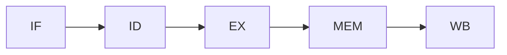

## Steps for final project 🥳

#### 1. Test (and document on the way)
- Add ***Testing*** chapter to include all test cases (described below)
	- Watch out for any issues 🙈
	- Prepare the environment for simulating everything in front of prof.
	- [ ] Done

#### 2. Reorganize Documentation 📃

- Extend ***Project Analysis*** to contain more information about the logic of each added component (natural language description, what happens, not related to signal naming convention or so)
	- [ ] Done
- Modify ***Design*** - remove the I/O descriptions, move them + output description tables to Implementation. What *remains* is pretty much related to diagrams, sub-components of each added unit.
	- [ ] Done
- Modify ***Implementation*** s.t. it contains the description of I/O, Conditions checked, not much code (maybe the description of BHT, Data Structures used), the output description tables, any more sofisticated components
	- [ ] Done
- Add ***Conclusions***
	- [ ] Done
- Add a nice cover image or so

### Proofreading
- Re-check it all and make sure it is clear, comprehensive, and correct.
	- [ ] Done

# Validation and Testing, Conclusions



## Test cases 🧪:

```vhdl
-- Register File Content
	signal curr_content: reg_content := (
		x"0000", -- 0
		x"0000", -- 1
		x"0001", -- 2
		x"0000", -- 3
		x"0003",
		x"0002",
		x"0002",
		x"ABCD",
		others => x"1111");

-- Memory Content
    signal curr_content: ram_content := (
        x"0003",
        x"0005", 
        x"0003",
        x"1111",
        x"ABC8",
        x"0004",
        x"0006",
        x"0008", 
        others => x"0000");
```

### 1. + 2. Data Hazard Forwarding to EX stage input A & B

```vhdl
		B"000_001_010_011_0_001", -- 0: add $3 = $1 + $2
		B"001_011_100_0001000", -- 1: addi $4 = $3 + 8
		B"000_010_011_101_0_001", -- 2: add $5 = $2 + $3
		others => x"0000"
```


|..|CC0|CC1|CC2|CC3|CC4|CC5|CC6|CC7|CC8|CC9|CC10|CC11|
|-|-|-|-|-|-|-|-|-|
|`0: add $3 = $1 + $2`|IF|ID|EX|MEM|WB|
|`1: addi $4 = $3 + 8`||IF|ID|EX|MEM|WB|
|`2: add $5 = $2 + $3`|||IF|ID|EX|MEM|WB|

#### Dependencies:
- I1 depends on the previous instruction $\Rightarrow$ Forwading to EX stage input A
- I2 depends on the instruction before the previous $\Rightarrow$ Forwarding to MEM stage input B

#### Results for no forwarding
- CC5: $3 = 0x1
- CC6: $4 = 0x8
- CC7: $5 = 0x1

#### Expected results with forwarding
- CC5: $3 = 0x1
- CC6: $4 = 0x9
- CC7: $5 = 0x2

##### Actual Results
- CC5: $3 = 
- CC6: $4 = 
- CC7: $5 = 

- figure containing the testbench waveform + signals  of interest:
	- CLK
	- Reset
	- PC content
	- Reg_File
	- ForwardA, ForwardB (EX)
	- ForwardA, ForwardB (MEM)

- [x] Done

### 3. Load Data Hazard + Forwarding

- [x] Done

### 4. Branch History table in a loop
- T$\to$NT
- NT$\to$T
- T$\to$T = loop

- [x] Done

### 5. Dependency Solving for Branch depending on prv (+ The one before the prv)
- not so detailed about all the signals that determine flushing, stalling, and so
- [x] Done

### 6. Boss program that tests it all ish (one of each type of hazard at least)

- [ ] Done
